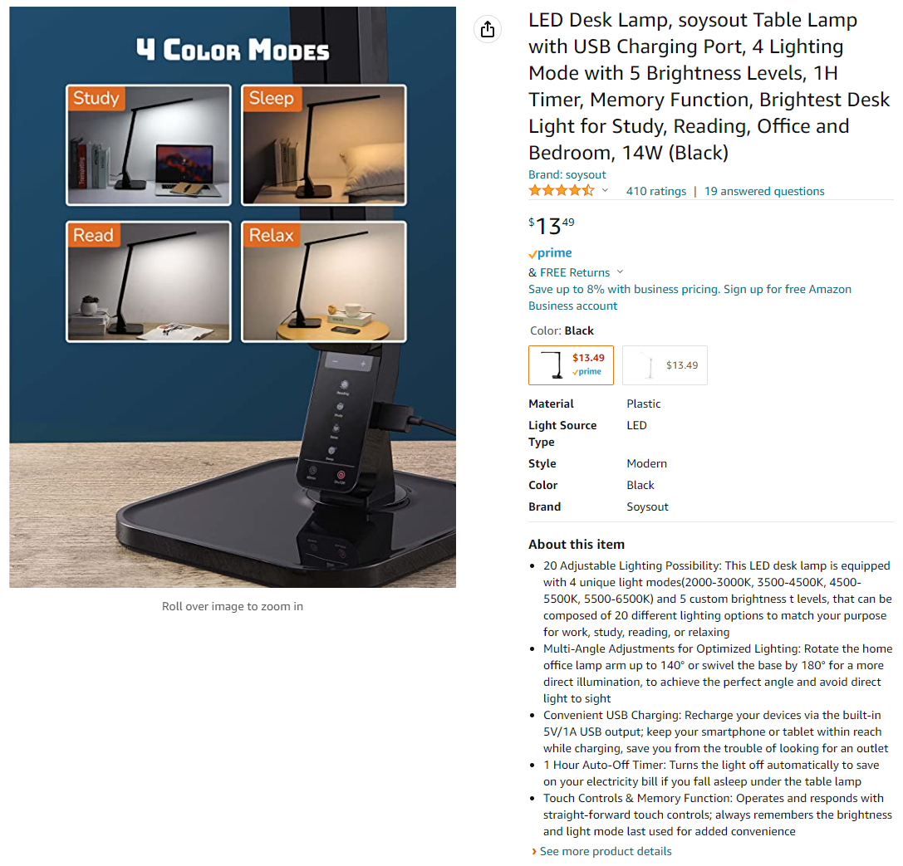
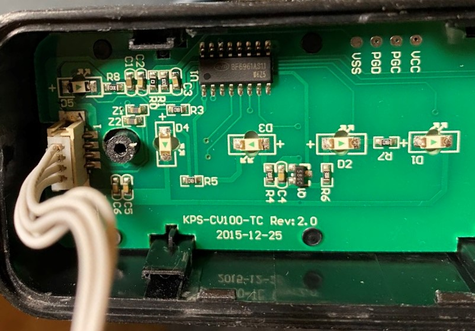
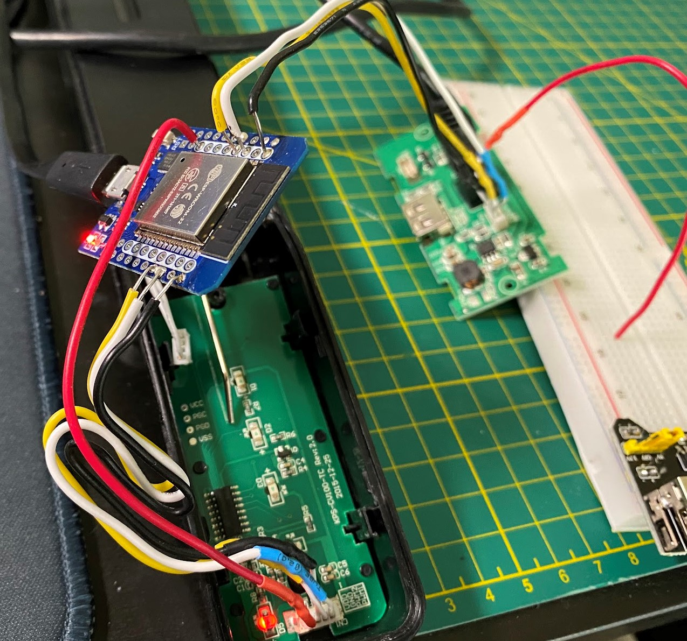
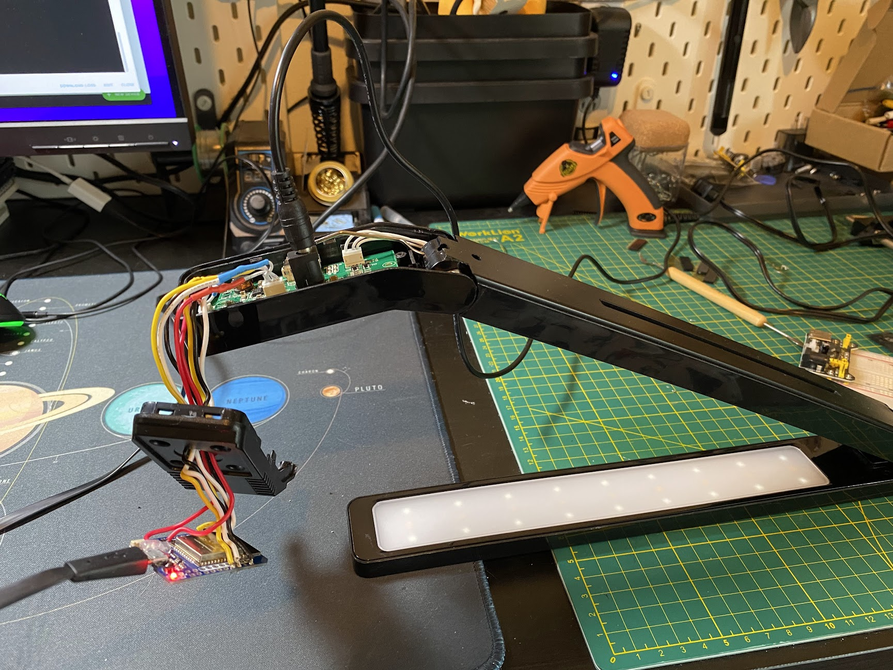

# [ESP32] Make the Dumb Lamp Smart

Converting a cheap Amazon desk lamp to a smart lamp with `ESPHome`.

This was the last light/lamp in my workbench area that's not controllable wirelessly, which was too annoying to have to walk by and turn off manually - _often time, I rely solely on scene and automation triggers to turn-off any workbench lights._ This weekend project makes yet another light integrated into my Home Assistant setup, with one of some ESP32 boards I have at hand.

## The lamp

It's a cheap LED desk lamp purchased from Amazon.com a while ago. 12V powered, color temperature and brightness tunable - via a capacitive button panel.

<table><tr><td>


_Image: Product page of the lamp_

</td></tr></table>

## The break-down

The goal is to have the lamp connected my Home Assistant server, so that it can be turned on-and-off, tuned color temperature and brightness, while keeping the original on-lamp control available (Physical buttons are still desired!).

Upon disassemble the lamp, there are two PCBs to be found. It turns out it has been designed in quite a modular way. The outer board is power related - LDOs regulate the 12V input, and deliver power to the control board (5V), the USB output (5V) and the LED panel (12V); The control board is right behind the capacitive button panel, which has a IC labelled as `BF6961AS11`.


<table><tr><td>


_Image: The control board PCB_

</td></tr></table>

I don't seem to find too much public information about such chip - but the rationale is clear enough - The IC (MCU) handles the capacitive buttons (scenes, brightness, power, power timer...), and eventually make two lanes of PWM as output, to control the cold-white and warm-white LED power respectively.

The 4-pin JST connector (also visible on the above photo) connect between the two PCB. They are $V_{in}$ (5V), `GND`, `PWM-cold` and `PWM-warm`.

## The work

The simplest yet effective solution is to have the ESP32 stand right between the two PCBs. The ESP32 will then produces two PWM to the power board and drive two LED channels independently. And by intercepting the two PWM signals from the control board, we will be able to read the current settings (i.e. button states) on the lamp. And this also makes modification at the minimum - we only need to re-route the 4-pin wire onto the ESP chip, without any changes on the lamp PCBs (there will be a catch, see below).

```
                                                  ┌───────┐
                                                  │  12v  │
                                                  │ power │
                                                  │ input │
                                                  └───┬───┘
                                                      │
                                                      │
    ┌─────────┐            ┌─────────┐            ┌───▼───┐
    │ control ◄───power────┤         ◄────power───┤ power │
    │  board  │            │  ESP32  │            │ board │
    │         ├───PWMx2────►         ├────PWMx2───►       │
    └────▲────┘            └─────────┘            └─┬───┬─┘
         │                                          │   │
         │                                          │  power
    ┌────┴────┐                                     │   │
    │on-board │                                  PWMx2  │
    │ buttons │                                     │   │
    └─────────┘                                   ┌─▼───▼─┐
                                                  │ LED_C │
                                                  │   +   │
                                                  │ LED_W │
                                                  └───────┘
```

The only issue, though, is we are not able to sync the lamp state to the LED indicators on the capacitive buttons. But I can live with this minor defect.

There is one technical problem - The control board operates on 5V (and so do the PWMs from the board), but ESP32 is 3v3 rated. I did find debates regarding ESP32 [being 5v-tolerant](https://www.qworqs.com/2021/05/19/are-the-esp32-and-esp8266-5v-tolerant-yes-they-officially-are/) or [not](https://www.esp32.com/viewtopic.php?t=18327), but I instead took on a different route.

The only helpful information on `BF6961AS11` is from [a product page](http://www.yunzhan365.com/basic/84628136.html), which I read the IC can operate on 2.5V - 5.5V. If we power the control board with 3.3V, we can get have the ESP32 read the PWM at 3.3V (experiments approved this).

However, the PWM@3.3V makes the LEDs slightly darker at full brightness, compare with the original PWM@5V. But since the brightness drop is not too significant, I would take this trade-off as oppose to dealing with fine-tuning the LED power drivers or level-shifting, or having the ESP runs at 5V which I treat it as a risk.

<table><tr><td>


_Image: Testing with ESP32. ESP32 stands in between the two boards_

</td></tr></table>

The prototype circuit has worked. On the software-side, as the first-time user of ESPHome, I found it surprising simple to setup, and integrate to HA in just a snap. My ESPHome project is also included - it's a basic [`cwww`-typed light](https://esphome.io/components/light/cwww.html) setup, and which plays well with the dual-PWM outputs. There isn't too much surprise here, the only one thing that I also have documented (separately) is the conversion function from the dual-PWM values (read from the control board) to the [`cwww` overall brightness](https://esphome.io/components/light/index.html#light-turn-on-action). For more detail, see the [project math](./math/led-fitting.ipynb).

A late-stage issue was discovered, however, after I removed the USB downloading cable and wanted to test as whole. Although the power LED lit on the ESP32, it didn't seem to boot on (not connected to the host WiFi). By comparing the drawn current of the ESP32 and the original chip, I found the ESP32 requires current more one magnitude greater than the original control board (`BF6961AS11`)! I have good reasons to suspect the 12V-5V LDO circuit on the power board was not designed for such current.

I ended up running the 5V from the $V_{cc}$ of the USB - Yes, the lamp also comes with a USB-A socket for charging (see the product page image) and it's rating for 5V 1A, thus obviously, it's a different 5V power source than the one for the control board.

Now everything works.

<table><tr><td>


_Image: Before assemble the lamp with ESP32._

</td></tr></table>

